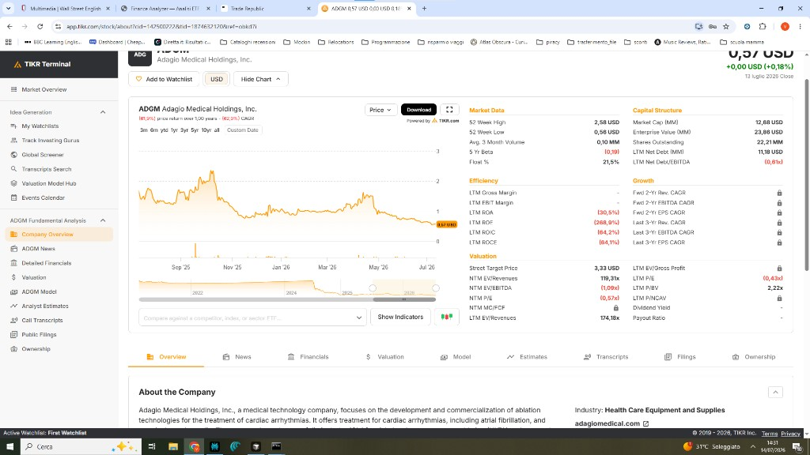
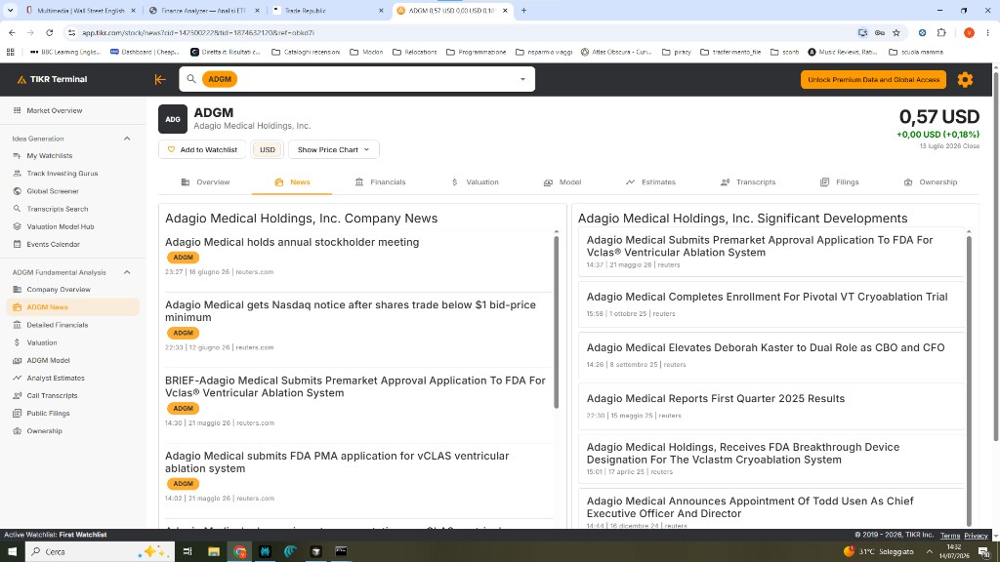
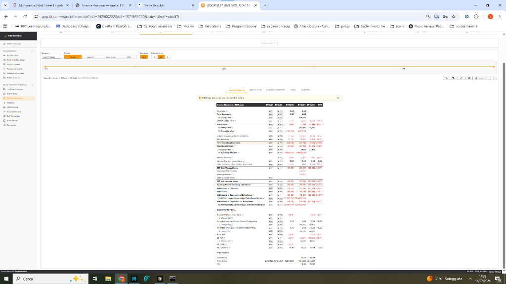
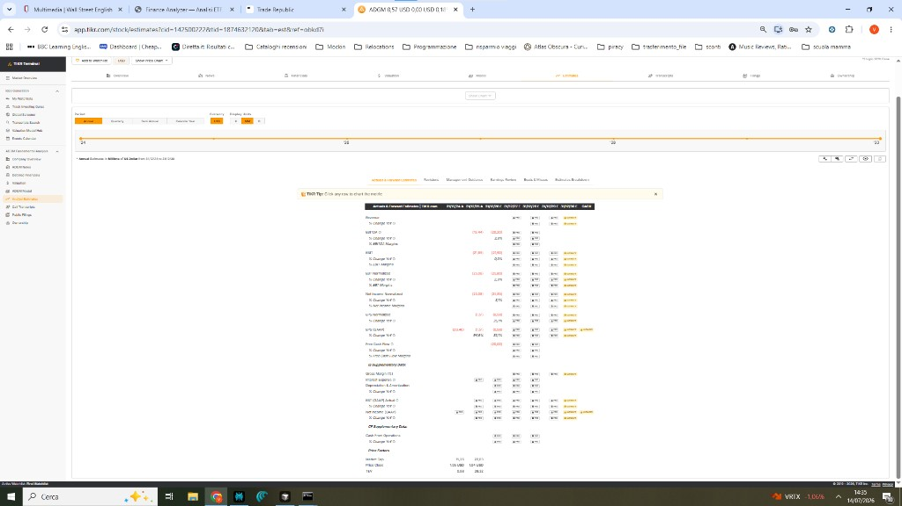
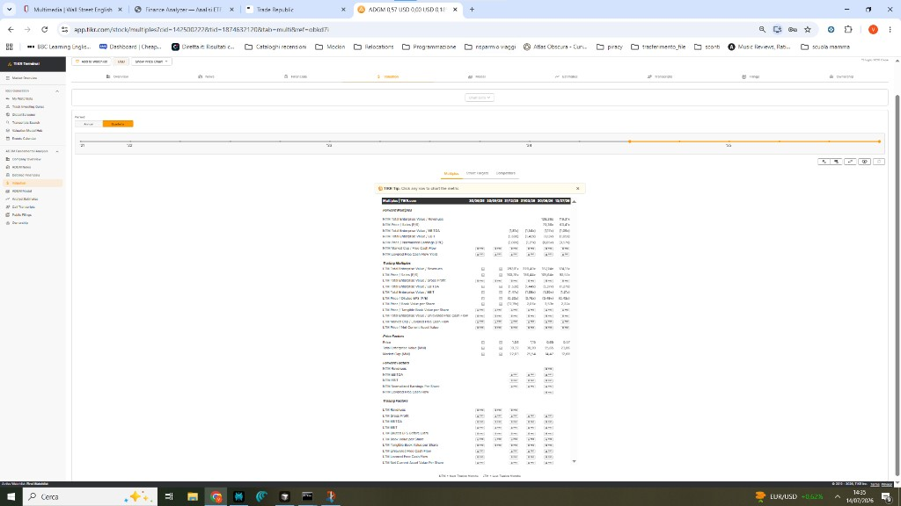
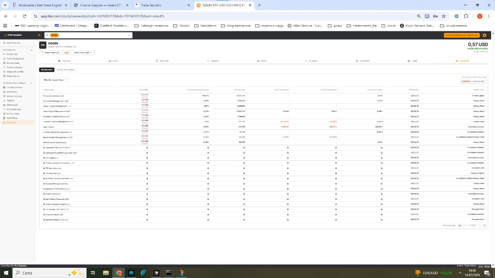

# Guida alla lettura di TIKR e filing SEC

**Esempio:** Adagio Medical Holdings, Inc. — ticker **ADGM**  
**Strumento educativo** — non consulenza finanziaria.

Questa guida spiega **foto per foto** cosa significano le schermate di [TIKR Terminal](https://app.tikr.com) e come collegarle ai **documenti SEC** (10-K, 10-Q, 8-K).

---

## Indice

1. [Foto 1 — Overview (panoramica)](#foto-1--overview-panoramica)
2. [Foto 2 — News e Significant Developments](#foto-2--news-e-significant-developments)
3. [Foto 3 — Financials (conto economico)](#foto-3--financials-conto-economico)
4. [Foto 4 — Analyst Estimates (stime analisti)](#foto-4--analyst-estimates-stime-analisti)
5. [Foto 5 — Valuation / Multiples](#foto-5--valuation--multiples)
6. [Foto 6 — Ownership (azionisti)](#foto-6--ownership-azionisti)
7. [Tabella Filings SEC — come leggerla](#tabella-filings-sec--come-leggerla)
8. [Checklist rapida (5 minuti)](#checklist-rapida-5-minuti)
9. [Glossario](#glossario)

---

## Foto 1 — Overview (panoramica)



### Cosa stai guardando

La **pagina principale** del titolo: prezzo, grafico storico e metriche chiave a destra.

### Elementi da leggere

| Zona | Cosa indica | Valore ADGM (esempio) | Interpretazione |
|------|-------------|------------------------|-----------------|
| **Prezzo attuale** | Quotazione oggi | **0,57 USD** | Penny stock (< 1 USD) |
| **Grafico** | Andamento prezzo | Discesa da ~2 USD (2025) | Mercato pessimista |
| **52 Week High / Low** | Massimo/minimo 12 mesi | 2,58 / **0,56** | Prezzo **al minimo annuo** |
| **Street Target Price** | Target medio analisti | **3,33 USD** | Molto sopra il prezzo attuale |
| **Market Cap (MM)** | Capitalizzazione | ~12,66 M | Micro-cap (azienda piccolissima) |
| **Enterprise Value (MM)** | Valore impresa + debito | ~23,85 M | EV > Market Cap → c’è debito |
| **LTM Net Debt (MM)** | Debito netto | ~11,18 M | Brucia cash, ha passività |
| **LTM P/E** | Prezzo / utili | Negativo | In perdita → P/E inutile |
| **LTM ROE / ROA** | Redditività | Molto negativi | Perdite pesanti |
| **Float %** | Azioni “libere” in borsa | 21,5% | Poche azioni in circolazione → volatilità |

### Messaggio sintetico (Foto 1)

> Titolo **piccolo, in perdita, vicino al minimo annuo**, con target analisti **~6× il prezzo**.  
> Il mercato non “crede” ancora al target — va capito **perché** (vedi Foto 2 e Filings SEC).

### About the Company (in basso)

Descrizione attività: **medtech** (tecnologie di ablazione per aritmie cardiache).  
Settore: **Health Care Equipment** — tipico profilo **alto rischio / alto reward** (FDA, trial clinici).

---

## Foto 2 — News e Significant Developments



### Cosa stai guardando

Due colonne: **notizie ufficiali** (sinistra) e **sviluppi significativi** (destra).

### Company News (sinistra)

Comunicati stampa e news (Reuters, ecc.). Per ADGM:

| Data | Evento | Perché importa |
|------|--------|----------------|
| **16/06/26** | Annual stockholder meeting | Voto azionisti |
| **12/06/26** | **Nasdaq notice** (bid price minimum) | **ATTENZIONE:** Rischio **delisting** se il prezzo resta troppo basso |
| **21/05/26** | FDA application (vCLAS system) | Catalizzatore positivo possibile |

### Significant Developments (destra)

Milestone aziendali (non sempre “news” giornalistiche):

| Data | Evento |
|------|--------|
| 21/05/26 | Domanda FDA |
| 01/10/25 | Completamento enrollment trial clinico |
| 16/12/24 | Nuovo CEO |

### Messaggio sintetico (Foto 2)

> La news **Nasdaq (12/06)** spiega parte del crollo a 0,57: se non risalgono sopra soglia minima, il titolo può **uscire dalla borsa USA**.  
> Leggi sempre l’**8-K** corrispondente sui Filings SEC (sezione 7).

---

## Foto 3 — Financials (conto economico)



### Cosa stai guardando

**Income Statement** (conto economico) in modalità **Annual**, valuta **USD**, unità **MM** (milioni).

### Colonne

| Colonna | Significato |
|---------|-------------|
| **31/12/21 … 31/12/24** | Anni **storici** (dati reali) |
| **31/12/25** | Anno in corso / stima |
| **LTM** | Last Twelve Months — ultimi 12 mesi rolling |

### Righe principali

| Riga | Cosa misura | ADGM |
|------|-------------|------|
| **Total Revenues** | Ricavi | ~**0,4 MM** (2024) → quasi **zero** |
| **Total Operating Expenses** | Costi operativi | ~**31 MM** |
| **Operating Income** | (31,32) | **Perdita operativa** |
| **Net Income** | (31,34) | **Perdita netta** |
| **Shares Outstanding** | Azioni in circolazione | Da 0,19M a **16,29M** → **diluizione** |

### Messaggio sintetico (Foto 3)

> Azienda **pre-revenue** (quasi nessun ricavo) con **costi alti** → brucia cassa ogni anno.  
> Aumento azioni = possibile **diluizione** (il tuo “pezzo” vale meno).

**Documento SEC da aprire:** ultimo **10-K** (annuale) o **10-Q** (trimestrale) — vedi sezione 7.

---

## Foto 4 — Analyst Estimates (stime analisti)



### Cosa stai guardando

Tabella **Annual & Forward Estimates**: cosa **prevedono** gli analisti per il futuro.

### Legenda colonne

| Suffisso | Significato |
|----------|-------------|
| **A** (es. 24A) | **Actual** — dato **reale** passato |
| **E** (es. 25E, 26E) | **Estimate** — **stima** futura |

### Righe chiave

| Metrica | Cosa significa |
|---------|----------------|
| **Revenue** | Ricavi previsti |
| **EBITDA / EBIT / Net Income** | Utili (parentesi = **perdita**) |
| **EPS Normalized** | Utile per azione |
| **Price Close** | Prezzo di chiusura di riferimento |

### ADGM — lettura

- **2025E–2028E:** ricavi bassi/zero, **Net Income negativo** (es. -25,33 MM nel 2025E)
- Gli analisti **non** prevedono profitti a breve

### Contraddizione da capire

| Dato | Valore |
|------|--------|
| Street Target (Foto 1) | **3,33 USD** |
| Stime utili (Foto 4) | **Perdite fino al 2028** |

Il target **non** si basa su utili prossimi, ma su **catalizzatori** (FDA, partnership, M&A). È una scommessa **speculativa**.

### Messaggio sintetico (Foto 4)

> Confronta sempre **target prezzo** (Foto 1) con **stime di perdita** (Foto 4).  
> Se non tornano, chiediti: *su cosa scommettono gli analisti?*

---

## Foto 5 — Valuation / Multiples



### Cosa stai guardando

Scheda **Valuation → Multiples**: multipli di valutazione **trimestrali**.

### Sezioni

| Sezione | Cosa contiene |
|---------|----------------|
| **Forward Multiples** | NTM (Next 12 months) — multipli su dati **futuri** |
| **Trailing Multiples** | LTM — multipli su dati **passati** |
| **Price Factors** | Prezzo, Enterprise Value, Market Cap |

### Multipli importanti

| Multiplo | Formula (semplificata) | ADGM |
|----------|------------------------|------|
| **EV/Revenues** | Valore impresa / ricavi | **119x** (NTM) → altissimo |
| **P/S** | Prezzo / ricavi per azione | **124x** (LTM) |
| **P/E** | Prezzo / utile per azione | N/A (perdita) |

### Price (riga in basso)

| Data | Prezzo |
|------|--------|
| 31/03/24 | 1,64 |
| 30/06/24 | 1,13 |
| 12/07/24 | **0,57** |

### Messaggio sintetico (Foto 5)

> Multipli **>100×** su ricavi quasi zero = il mercato valuta la **pipeline futura**, non il business attuale.  
> Se FDA/trial falliscono, il titolo può crollare ulteriormente.

**Sottoscheda utile:** *Street Targets* (target per analista + date).

---

## Foto 6 — Ownership (azionisti)



### Cosa stai guardando

Tab **Ownership → Shareholders**: chi possiede il titolo (ultimo report istituzionale).

### Colonne

| Colonna | Significato |
|---------|-------------|
| **Investor Name** | Nome fondo / investitore |
| **Value (MM)** | Valore posizione ($ milioni) |
| **% of Shares Outstanding** | % del titolo posseduta |
| **# Shares Held** | Numero azioni |
| **Chg in Shares Held** | Variazione recente |
| **Report Date** | Data del report (es. **30/03/24**) — spesso **trimestrale** |
| **Investor Type** | Hedge fund, Private Equity, ecc. |

### ADGM — punti salienti

| Investitore | % | Nota |
|-------------|---|------|
| **Perceptive Advisors LLC** | **~44,5%** | Dominante — se vende, forte impatto |
| Altri hedge fund | 2–2,5% ciascuno | Posizioni minori |
| **Icone lucchetto** | — | Dati visibili solo con piano Pro TIKR |

### Messaggio sintetico (Foto 6)

> Titolo **concentrato** in pochi fondi.  
> Controlla **Report Date**: i dati possono essere **vecchi** di mesi (non real-time).

---

## Tabella Filings SEC — come leggerla

I **Filings** sono documenti **ufficiali** depositati alla SEC (regolatore USA).  
La colonna **Release Date** = **data di pubblicazione** (quello che cercavi per “di quando è l’analisi”).

### Tipi di documento (memorizza)

| Form | Contenuto | Frequenza |
|------|-----------|-----------|
| **10-K** | Bilancio **annuale** completo | 1×/anno |
| **10-K/A** | **Rettifica** al 10-K | Se necessario |
| **10-Q** | Bilancio **trimestrale** | 4×/anno |
| **8-K** | Evento **importante** (FDA, Nasdaq, CEO…) | Quando succede |
| **DEF 14A** | Materiali **assemblea** azionisti | Prima del voto |
| **S-1 / S-3 / S-8** | **Offerta nuove azioni** | **ATTENZIONE:** Diluizione possibile |
| **Earnings Q1/Q2…** | Comunicato **risultati** | Trimestrale |

### Timeline ADGM — ultimi documenti rilevanti

| Release Date | Documento | Cosa cercare |
|--------------|-----------|--------------|
| **13/07/26** | 10-K/A | Correzioni al bilancio 2025 |
| **16/06/26** | 8-K | Assemblea azionisti |
| **12/06/26** | 8-K | **ATTENZIONE:** **Avviso Nasdaq** (prezzo minimo) |
| **21/05/26** | 8-K | Domanda **FDA** |
| **12/05/26** | 10-Q + Earnings Q1 | Risultati Q1 2026, **cash** |
| **27/03/26** | 10-K | Bilancio annuo 2025 |

### Cosa leggere dentro un 10-Q / 10-K (ricerca rapida)

Cerca queste parole (Ctrl+F):

| Parola chiave | Perché |
|---------------|--------|
| **cash and cash equivalents** | Quanto cash resta |
| **going concern** | Rischio sopravvivenza azienda |
| **net loss** | Perdita netta |
| **dilution** / **shares issued** | Nuove azioni emesse |
| **Nasdaq** / **delisting** | Rischio uscita da borsa |

### Ordine di lettura consigliato

```
1. Ultimo 8-K        → cosa è successo ADESSO
2. Ultimo 10-Q/10-K  → numeri ufficiali (cash, perdite)
3. Analyst Estimates → previsioni analisti
4. Street Target     → target vs prezzo
5. News              → contesto
```

---

## Checklist rapida (5 minuti)

Per ogni titolo (es. ADGM):

- [ ] **Foto 1** — Prezzo vs target, market cap, debito, 52W low
- [ ] **Filings** — Ultimo **8-K** (eventi critici?)
- [ ] **Filings** — Ultimo **10-Q** o **10-K** (cash, going concern)
- [ ] **Foto 4** — Analisti prevedono profitti o solo perdite?
- [ ] **Foto 1 + sito** — Quanti analisti? Data ultimo target?
- [ ] **Foto 2** — FDA, Nasdaq, offerte azioni?
- [ ] **Foto 6** — Ownership troppo concentrata?

---

## Glossario

| Termine | Significato |
|---------|-------------|
| **LTM** | Last Twelve Months — ultimi 12 mesi |
| **NTM** | Next Twelve Months — prossimi 12 mesi |
| **EV** | Enterprise Value — valore impresa (include debito) |
| **MM** | Millions — milioni |
| **E** | Estimate — stima / previsione |
| **A** | Actual — dato reale |
| **Upside** | Quanto potrebbe salire vs prezzo attuale (target − prezzo) |
| **Spread target** | Distanza tra target min e max analisti (es. 3–4) |
| **Diluizione** | Emissione nuove azioni → la tua quota vale meno |
| **8-K** | “Breaking news” obbligatoria per la SEC |
| **Delisting** | Espulsione dalla borsa (es. Nasdaq) |

---

## Collegamento con il tuo sito Finance Analyzer

| Dato nel sito | Equivalente TIKR |
|---------------|------------------|
| **% Buy (analisti)** | Consenso Buy/Hold/Sell |
| **Target medio / range** | Street Target Price (Foto 1) |
| **Upside %** | (Target − prezzo) / prezzo |
| **Data target / consenso** | Upgrade/Downgrade history (Yahoo) |
| **Filings SEC** | Solo su TIKR / [SEC EDGAR](https://www.sec.gov/edgar/search/) |

---

## Come esportare in PDF

1. Apri questo file in **VS Code** o **Cursor** e usa anteprima Markdown (Ctrl+Shift+V), poi **Stampa → Salva come PDF**.
2. Oppure incolla su [Google Docs](https://docs.google.com) / Word e esporta PDF.
3. Se hai **Pandoc** + **MiKTeX** installati, dalla cartella `docs/guida-tikr`:
   ```bat
   pandoc GUIDA_LETTURA_TIKR_ADGM.md -o GUIDA_LETTURA_TIKR_ADGM.pdf --resource-path=. --pdf-engine=xelatex -V geometry:margin=2.5cm
   ```
   (Usa `xelatex`, non `pdflatex`: gestisce italiano e caratteri Unicode.)

---

*Ultimo aggiornamento: luglio 2026 — esempio ADGM (Adagio Medical Holdings, Inc.)*
